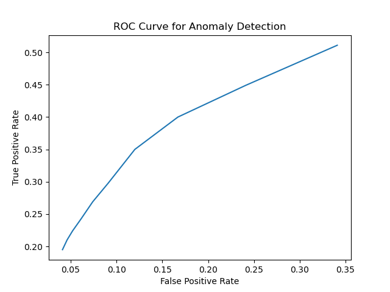
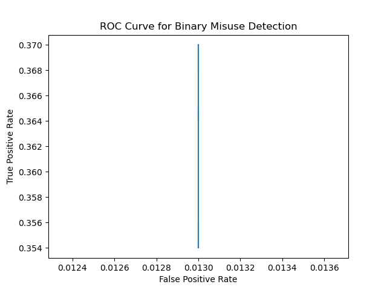

The goal is to implement instance based learning on NSLKDD Dataset

# Preprocessing

## Run preprocess.py first

preprocess.py handles the preprocessing of the raw csv files into numpy arrays used for training and testing. First, we read in the csv to pandas dataframes and then to numpy arrays. Then, we get rid of the nominal attributes, namely elements 1,2,3. Then we split into x and y sets. The x sets have all of the binary and numerical attributes of the NSLKDD Datasets. The y sets have the class labels. 

For preparing our misuse detection sets, we encode the class labels as follows: normal = 0, DOS = 1, Probe = 2, R2L = 3, U2R = 4 and we leave the training sets as is, with a mix of normal and attack samples. For preparing our anomaly detection sets, we encode normal as 0 and attack as 1. We only include normal samples in the training sets.

The .npy files above represent our training and testing x and y sets. We do not include an anomaly_y_train, because all of our anomaly_x_train samples are normal, meaning our y labels would all be zero.


# Anomaly Detection
After running preprocess.py and extracting all normal instances for the training data set, we find the nearest neighbor for each instance in the testing dataset using sklearn's knearest function. We vary the control threshold 10 times, starting from a distance of 10 to 100 in intervals of ten distance points. Anything greater than the threshold will be considered an anomaly. 

We calculate the FPR and TPR for each control threshold, and then plot the full ROC curve and get the area under the ROC curve. 

```bash
threshold = 10, FPR: 0.341, TPR: 0.511, F1: 0.72
threshold = 20, FPR: 0.241, TPR: 0.449, F1: 0.71
threshold = 30, FPR: 0.167, TPR: 0.4, F1: 0.7
threshold = 40, FPR: 0.12, TPR: 0.35, F1: 0.67
threshold = 50, FPR: 0.091, TPR: 0.298, F1: 0.62
threshold = 60, FPR: 0.074, TPR: 0.269, F1: 0.59
threshold = 70, FPR: 0.061, TPR: 0.242, F1: 0.55
threshold = 80, FPR: 0.052, TPR: 0.224, F1: 0.53
threshold = 90, FPR: 0.046, TPR: 0.21, F1: 0.51
threshold = 100, FPR: 0.041, TPR: 0.195, F1: 0.48
AUC for this ROC: 0.11898650000000001
```
Below is the ROC curve for our anomaly detection algorithm.


We also find the F1 score for each threshold. The F1 score is a solid measure when both FPR and TPR need to be checked. In this case, we do not only want to rely on FPR to measure our performance because then, to have a "perfect" model, we could just classify everything as negative and never return a false positive. In contrast, we could also classify everything as positive if we only measured our TPR, because we would never return anything that wasn't positive, and every positive would be correctly identified.

The "best" F1 score we received was from control threshold = 10 distance points at an F1 of .72. For that reason, we believe this is the best threshold.

# Misuse Detection
We first start with a binary classification of the test dataset. We need to fit a KNNCLassifier object to our binary train y dataset (normal and intrusive) and our train x dataset. Then, we select the first 10 odd numbers as k for 10 different classfier instances. Then, we test each classifier, print the False Positve and True Positive rate, as well as the F1 score. We also show the ROC curve and the Area under the ROC curve for these 10 binary classifiers.
```bash
binary, k=1, FPR: 0.013, TPR: 0.356, F1: 0.76
binary, k=3, FPR: 0.013, TPR: 0.354, F1: 0.76
binary, k=5, FPR: 0.013, TPR: 0.354, F1: 0.76
binary, k=7, FPR: 0.013, TPR: 0.365, F1: 0.77
binary, k=9, FPR: 0.013, TPR: 0.365, F1: 0.77
binary, k=11, FPR: 0.013, TPR: 0.364, F1: 0.77
binary, k=13, FPR: 0.013, TPR: 0.364, F1: 0.77
binary, k=15, FPR: 0.013, TPR: 0.365, F1: 0.77
binary, k=17, FPR: 0.013, TPR: 0.37, F1: 0.78
binary, k=19, FPR: 0.013, TPR: 0.368, F1: 0.77
AUC for this ROC: 0.0
```
Below is the ROC curve for our anomaly detection algorithm.


Then, we do the same thing for multiclass classifiers. The same 10 k were used. The class labels now included normal, DoS, Probe, U2R, and R2L instances. The FPR and TPR are printed for each classifier multiclass labels, as well as the confusion matrices for each of the 10 multiclass classifiers. This information is printed below.

```bash
multi, k=1, FPR: 0.013, TPR: 0.318
[[9418  150  135    6    1]
 [1464 5682  313    1    0]
 [ 644  316 1452    9    0]
 [2638   40  181   24    2]
 [  56    0    2    2    7]]
multi, k=3, FPR: 0.013, TPR: 0.312
[[9412  167  119   12    0]
 [1516 5630  313    1    0]
 [ 684  334 1403    0    0]
 [2608   50  221    6    0]
 [  65    0    0    0    2]]
multi, k=5, FPR: 0.013, TPR: 0.31
[[9425  169  105   11    0]
 [1552 5621  287    0    0]
 [ 666  389 1366    0    0]
 [2598   54  225    8    0]
 [  67    0    0    0    0]]
multi, k=7, FPR: 0.013, TPR: 0.32
[[9426  171  103   10    0]
 [1333 5857  270    0    0]
 [ 645  434 1342    0    0]
 [2586   68  223    8    0]
 [  67    0    0    0    0]]
multi, k=9, FPR: 0.013, TPR: 0.319
[[9427  173  102    8    0]
 [1392 5875  193    0    0]
 [ 646  477 1298    0    0]
 [2564   82  231    8    0]
 [  67    0    0    0    0]]
multi, k=11, FPR: 0.013, TPR: 0.319
[[9424  177  100    9    0]
 [1418 5928  114    0    0]
 [ 664  492 1265    0    0]
 [2565   81  231    8    0]
 [  67    0    0    0    0]]
multi, k=13, FPR: 0.012, TPR: 0.32
[[9431  172   99    8    0]
 [1422 5940   98    0    0]
 [ 652  500 1269    0    0]
 [2561   84  232    8    0]
 [  67    0    0    0    0]]
multi, k=15, FPR: 0.013, TPR: 0.321
[[9426  176  100    8    0]
 [1401 5979   80    0    0]
 [ 653  515 1253    0    0]
 [2558   84  235    8    0]
 [  67    0    0    0    0]]
multi, k=17, FPR: 0.012, TPR: 0.324
[[9429  176   99    6    0]
 [1291 6066  103    0    0]
 [ 639  543 1239    0    0]
 [2556   86  239    4    0]
 [  67    0    0    0    0]]
multi, k=19, FPR: 0.013, TPR: 0.325
[[9422  176  104    8    0]
 [1337 6081   42    0    0]
 [ 634  547 1240    0    0]
 [2556   85  240    4    0]
 [  67    0    0    0    0]]


```